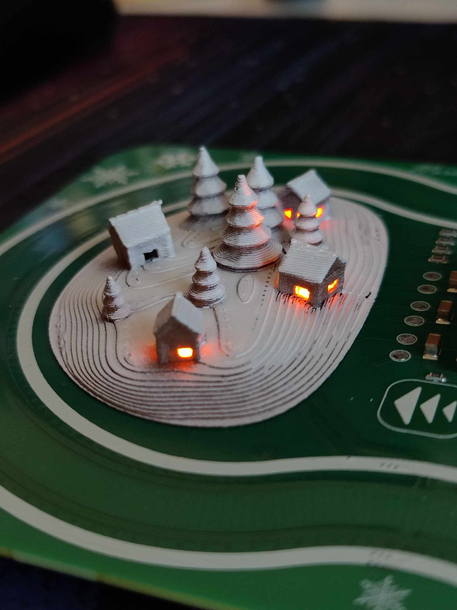
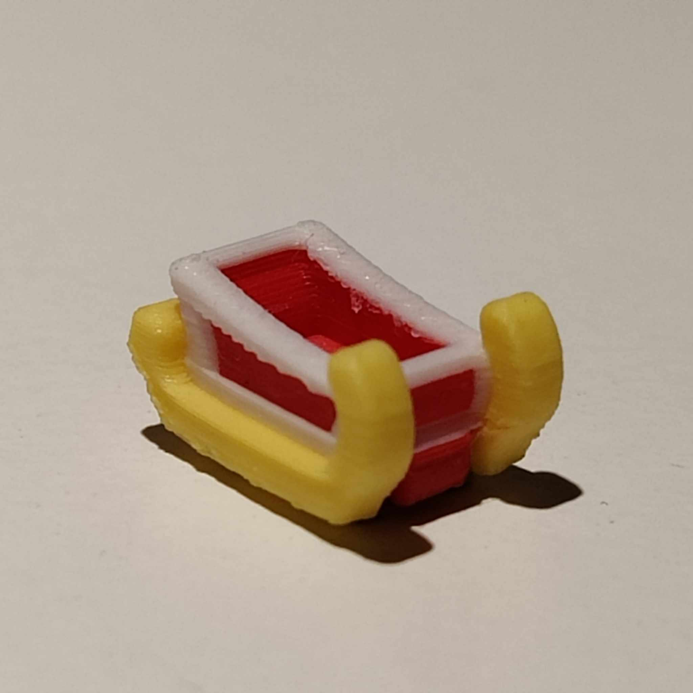
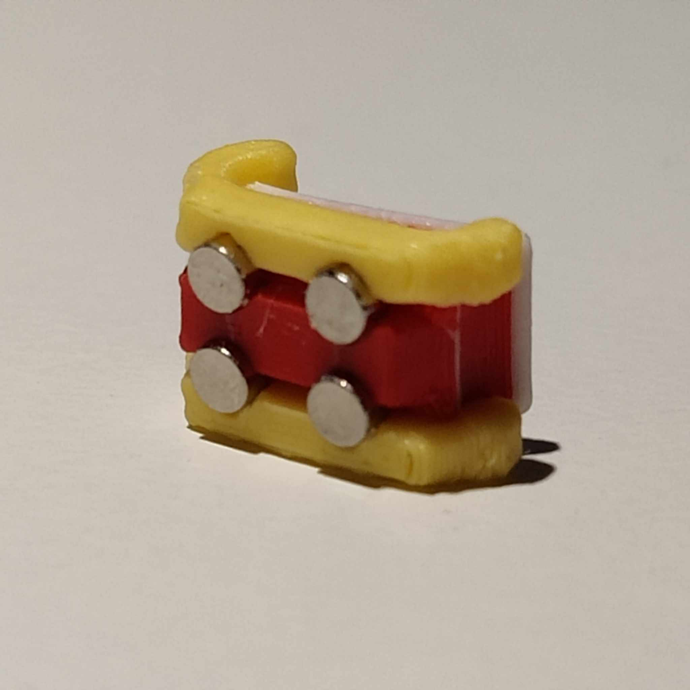
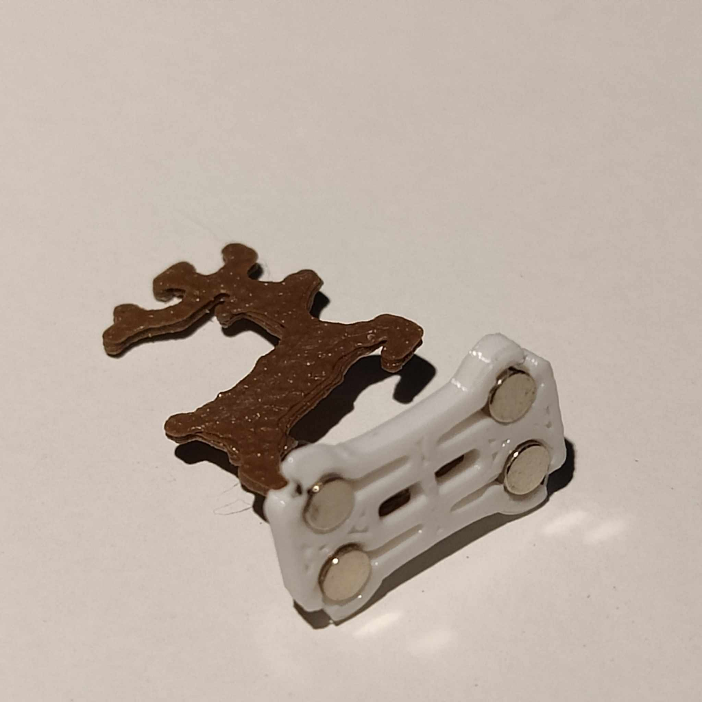



# North Pole Circuit
Also available on [janky-jingle-crew.com/NorthPoleCircuit](https://janky-jingle-crew.com/NorthPoleCircuit/)



Merry Christmas, and a Happy New Year! This year, we present the first *Dual-core, 32-bit, high-speed, USB-C, hyper-festive, magnetic propulsion **christmas card!***

## User Guide

Press the bottom buttons to control the track. There are three speed levels for each direction.
The upper music button plays a small Christmas Jingle accompanied with a small "dance".

## Technical Details

### Working Principle
The propulsion is driven by the [Lorentz force law](https://en.wikipedia.org/wiki/Lorentz_force), which acts orthogonally to the directions of both the current flow and the magnetic field. By using magnets with poles aligned vertically (top and bottom) and positioning the PCB traces perpendicular to the track’s direction, the magnets experience a forward or backward force along the track based on the current direction.

The tracks are setup as two phases with 90-degree phase shift, allowing the same control as a bipolar stepper motor. A guard rail is also added to keep the magnets centered during curves. The guard rails are run along the outside of the track (parallel with track direction) which means an inwards force is generated instead.

For more detailed explanations of the working priciples, refer to **Jeff McBride’s** [blog post](https://jeffmcbride.net/gauss-speedway/).

### Construction
The PCB consists of the phase tracks, guard rail, driver circuit and decoration circuit. The phases and guard rail are generated by Jeff's [curvycad](https://github.com/mcbridejc/curvycad/tree/main) plugin for KiCad. 

#### Driver circuit
The driver circuit controls the phase tracks and guard rails. The design is heavily based on Jeff’s design with some modifications for cost-effectiveness and USB compatibility:

* Power Supply: Utilizes 5V USB-C input instead of a barrel jack plug.
* Microcontroller: Replaces the STM32 with the CH32V003, which is:
    * Cheaper, ~20 cents!
    * 5V compatible
* Motor Drivers: Uses DRV8833 motor drivers instead of ZXBM5210 for:
    * Lower driver resistance (1.2 Ohms vs 0.3 Ohms)

#### Decoration circuit
A separate circuit using another CH32V003 handles LED control and buzzer music.

* CH32V003 microcontroller: Used for controlling decorative elements.
* I2C Communication: Links the decoration circuit with the driver circuit.
* Buzzer: Plays a short Christmas jingle with synchronized magnet movements.
* LEDs: PWM brightness control through GPIOs for the 3D-printed village/forest decoration.

## Manufacturing
### Trees and cottages
The trees, cottage and ground are all one solid 3D-print, with a touch of white matte primer spray paint from above. Here, it is printed in 'army brown' PLA @ 0.2 mm layer height. Rectangular holes under the cottages give space for LEDs to illuminate them. This print is mounted to the PCB with 2 * M2.5x4mm screws.

### Sleigh and reindeer
The sleigh and reindeer are also 3D-printed, but are a bit different. Here, the sleigh is one print with multiple filaments, while the deer consists of two different; a white base for the magnets and the reindeer itself in the same brown filament as the trees.

          

Mounting the magnets is quite tricky, and it is crucial to orient them correctly! The ability to press fit is highly dependent on the 3D-printer used. In this case for the sleigh, a small drop of super glue is applied on the magnets before pressed into the sleigh using a specialized fixture. The base for the reindeer is flat, which enables the magnets to be pressed in before the reindeer itself is mounted.

## Credits

Special thanks to **Jeff McBride**, this project was heavily inspired by his awesome [Gauss speedway](https://jeffmcbride.net/gauss-speedway/).

Also thank you **cnlohr** for the [ch32v003fun](https://github.com/cnlohr/ch32v003fun) framework which was used to program the microcontrollers.

Thanks to **Ida Udd** for the beautiful design of the reindeer and **Rikard Karlsson** for helping us 3D print the sleighs. 

## Contributors
The Janky Jingle Crew 2024 consists of: 

 - [Daniel Quach](https://github.com/Muoshy): Project lead, PCB, Code
 - [Johan Wheeler](https://github.com/johanwheeler): PCB Track, sled design
 - [Gustav Abrahamsson](https://github.com/GustavAbrahamsson): Decorations, sled design
 - [Adam Anderson](https://github.com/adaand00): Code

## Previous years

Go to [janky-jingle-crew.com](https://janky-jingle-crew.com)
