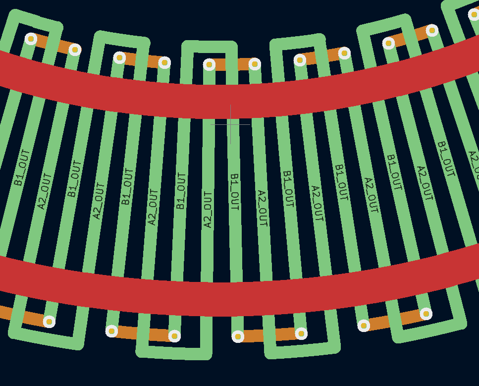
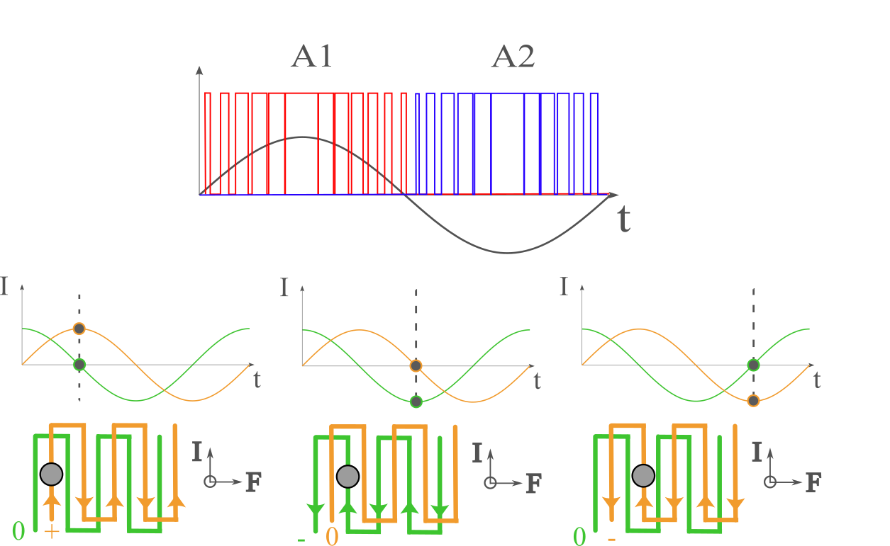
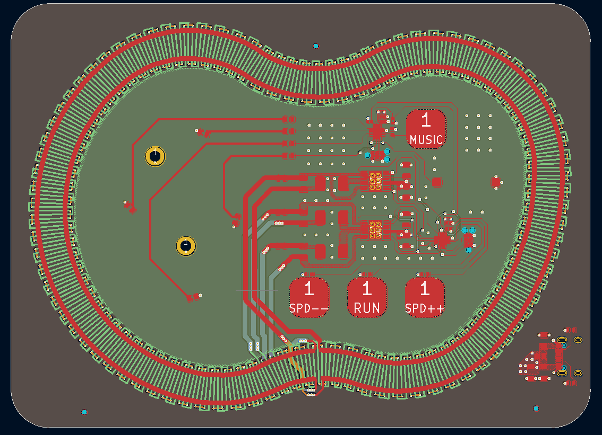



# North Pole Circuit
Also available on [janky-jingle-crew.com/NorthPoleCircuit](https://janky-jingle-crew.com/NorthPoleCircuit/)



Merry Christmas, and a Happy New Year! This year, we present the first *Dual-core, 32-bit, high-speed, RISC-V, USB-C, hyper-festive, magnetic propulsion **christmas card!***

(Click on image to watch demo video)

Featured on [Hackaday.com](https://hackaday.com/?p=739494), [hackster.io](https://www.hackster.io/news/racing-toward-christmas-4728aa6665af)

## User Guide

Plug in a USB-C cable, place the card on a flat surface, and put the deer and the sleigh onto the track. The three buttons at the bottom control the speed, there are three levels for each direction. The upper music button plays a Christmas Jingle accompanied by a small "dance".

## Working Principle
The propulsion can by explained by the reaction force from the [Lorentz force law](https://en.wikipedia.org/wiki/Lorentz_force) or [Magnetic forces](https://en.wikipedia.org/wiki/Force_between_magnets#Magnetic_force_due_to_non-uniform_magnetic_field), which acts orthogonally to the directions of both the current flow and the magnetic field of the magnet. Both seem to give the correct force vector, maybe someone smarter can figure out which one it actually is. By using magnets with poles aligned vertically (top and bottom) and positioning the PCB traces perpendicular to the track’s direction, the magnets experience a forward or backward force along the track based on the current direction.

The tracks (A and B) are driven with two sinusoidal waveforms with a 90-degree phase shift between them, similar to microstepping a bipolar stepper motor. A guard rail is also added to keep the magnets centered during curves. The guard rails run along the outside of the track (parallel with track direction) which means an inwards force is generated instead. Reverse propulsion is achieved by simply stepping the sinusoidal in the other direction.

For more detailed explanations of the working principles, refer to **Jeff McBride’s** [blog post](https://jeffmcbride.net/gauss-speedway/).

## Design
The PCB consists of the phase tracks, guard rail, driver circuit and decoration circuit. The phases and guard rail are generated by Jeff's [curvycad](https://github.com/mcbridejc/curvycad/tree/main) plugin for KiCad. A 4 layer board was used for this, with 1 oz inner copper weight to reduce phase resistance. The driver circuit and the decoration circuit each have their own CH32 microcontroller, which communicate with each other using I2C. This was mainly done because a lack of timer modules.

### Driver circuit
The driver circuit controls the phase tracks and guard rails. The design is heavily based on Jeff’s design with some modifications for cost-effectiveness and USB compatibility:

* Power Supply: Utilizes 5V USB-C input instead of a barrel jack plug. The total current draw when moving is 500 mA.
* Microcontroller: Replaces the STM32 with the CH32V003, which is cheaper, ~20 cents! It is also 5V compatible.
* Motor Drivers: Uses DRV8833 motor drivers instead of ZXBM5210 for lower driver resistance (0.3 Ohms vs 1.2 Ohms), making the track a bit more efficient.

### Decoration circuit
A separate circuit using another CH32V003 handles LED control and buzzer music.

* CH32V003 microcontroller: Used for controlling decorative elements.
* I2C Communication: Links the decoration circuit with the driver circuit to synchronize dance.
* Buzzer: Plays a short Christmas jingle.
* LEDs: PWM brightness control through GPIOs for the 3D-printed village decoration. 

## Manufacturing

This year we made a total of 50 cards, all manufactured and assembled by JLC PCB. Each PCB then had decorations with trees and cottages attached, got rubber feet mounted, had one sleigh and one deer attached, was programmed, and was finally tested.

   

### Trees and cottages
The trees, cottage and ground are all one solid 3D-print, with a touch of white matte primer spray paint from above. Here, it is printed in 'army brown' PLA @ 0.2 mm layer height. Rectangular holes under the cottages give space for LEDs to illuminate them. This print was mounted to the PCB with 2 * M2.5x4mm screws.

### Sleigh and reindeer
The sleigh and reindeer are also 3D-printed, but are a bit different. The sleigh is one print with multiple filaments, while the deer consists of two different; a white base for the magnets and the reindeer itself in the same brown filament as the trees.

          

Mounting the magnets (2x1 mm, N42/N52) was quite tricky, and it is crucial to orient them correctly! We fine-tuned the models so that the magnets would press-fit into place. For the sleigh, a small drop of super glue was applied to the magnets before being pressed into the sleigh using a specialized fixture. The reindeer is simpler since the base is flat, the magnets were pressed in before the reindeer itself was mounted on top.

## FAQ
### How do I reproduce this?
#### PCB
The production files for the PCB are provided in PCB/production/. 
Upload the gerber, BOM and position files to JLCPCB to order the boards. 
Some important special options:
* LeadFree HASL (No lead poisoning for friends and family)
* 1 oz Inner Copper weight (Needed to reduce phase resistance)
* Layer Sequence (JLCPCB usually gets it right from the gerber names but it's safer to specify them)
    * L1 F_Cu
    * L2 In1_Cu
    * L3 In2_Cu
    * L3 B_Cu
* Impedance control (Minimize distance/prepreg between L1 and L2 = Stronger field strength)
    * Choose one of these:
        * JLC041611-7628 (0.2104mm prepreg, allows for cheaper economic assembly, used in ours)
        * JLC041611-3313 (0.092mm prepreg, standard assembly required)
        * JLC041611-1080 (0.069mm prepreg, standard assembly + extra fee required)
#### Flashing
A WCH-LinkE or similar programmer is required, see [ch32v003fun](https://github.com/cnlohr/ch32v003fun?tab=readme-ov-file#ch32v003fun).
Some type of 6 pin (2x3 1.27mm pitch) pogo connector is required (we use a TagConnect TC2030NL).
Or you can solder wires directly to the pads. Only SWDIO and GND need to be connected (power from USB instead to ensure programmer does not source too much current). 

### How much did this all cost?
For 50 boards, the cost breakdown **(VAT & shipping excluded)** looks like this:
* PCBs $140
* Components $127
* Assembly Fee $46
* Filament & Spray paint $40
* Magnets $35
* Screws $10

Total cost was \$398 which rounds out to roughly 8$ per card. 
**Do note that JLCPCB can be quite costly for smaller batches (~$90 for 5 populated boards).** 

### More technical tidbits
See the discussion in [#1](https://github.com/Janky-Jingle-Crew/NorthPoleCircuit/issues/1) with **cnlohr**. 

## Credits

Special thanks to **Jeff McBride**, this project was heavily inspired by his awesome [Gauss speedway](https://jeffmcbride.net/gauss-speedway/).

Also thank you **cnlohr** for the [ch32v003fun](https://github.com/cnlohr/ch32v003fun) framework which was used to program the microcontrollers.

Thanks to **Ida Udd** for the beautiful design of the reindeer and **Rikard Karlsson** for helping us 3D print the sleighs in beautiful multi-color detail. 

## Contributors
The Janky Jingle Crew 2024 consists of: 

 - [Daniel Quach](https://github.com/Muoshy): Project lead, PCB, Code, Assembly, Documentation
 - [Johan Wheeler](https://github.com/johanwheeler): PCB Track, sleigh design, Assembly
 - [Gustav Abrahamsson](https://github.com/GustavAbrahamsson): Decorations, sleigh design, Assembly
 - [Adam Anderson](https://github.com/adaand00): Code, sleigh design, Assembly, Documentation

## Previous years

Go to [janky-jingle-crew.com](https://janky-jingle-crew.com)
